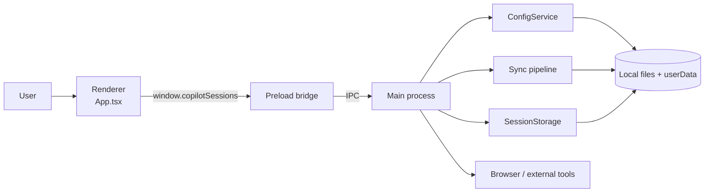
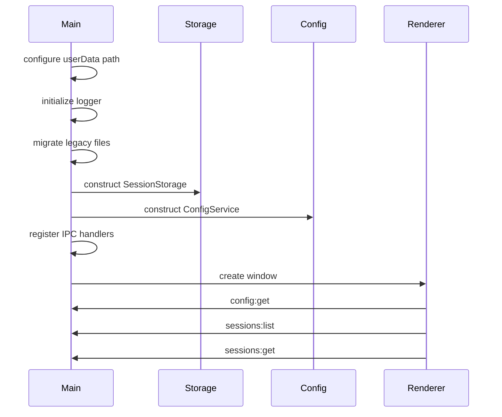

# Runtime Architecture

## At a glance

The app uses the standard Electron split:

- **main process**: lifecycle, filesystem access, sync, storage, IPC, external integrations
- **preload bridge**: typed, narrow API exposed to the renderer
- **renderer**: React UI and interaction state

The renderer does not get direct Node access.

## Runtime boundary diagram

## Layer ownership

### Main process

Primary files:

- `src/main/index.ts`
- `src/main/ipc.ts`
- `src/main/config.ts`
- `src/main/sync.ts`
- `src/main/storage.ts`

It owns:

- app startup and window creation
- canonical `userData` path setup
- migration of older `config.json` / `sessions-store.json`
- file logging
- config loading/saving
- session discovery, parsing, and merging
- persistence and search indexes
- external link handling
- open-in-tool actions

### Preload

Primary file:

- `src/preload/index.ts`

It exposes a single typed bridge:

- `window.copilotSessions`

That bridge maps renderer requests to IPC calls and keeps privileged behavior out of the renderer.

### Renderer

Primary files:

- `src/renderer/src/App.tsx`
- `src/renderer/src/components/SessionListSidebar.tsx`
- `src/renderer/src/components/SessionDetailView.tsx`
- `src/renderer/src/components/SettingsModal.tsx`

It owns:

- shell state
- search/filter state
- selected session/detail state
- sync status and queueing UX
- sidebar sizing
- transcript rendering and interactions

## Window security posture

The window is created with:

- `contextIsolation: true`
- `nodeIntegration: false`
- preload at `../preload/index.mjs`

`sandbox` is currently `false`, but the practical boundary still relies on the typed preload API and no direct Node access in the renderer.

## Boot flow

## IPC surface

Primary file:

- `src/main/ipc.ts`

Main IPC channels:

| Channel | Owner |
| --- | --- |
| `config:get` | `ConfigService.load()` |
| `config:save` | `ConfigService.save()` |
| `config:open-file` | opens config JSON |
| `sessions:sync` | `syncSessions()` |
| `sessions:list` | `SessionStorage.list()` |
| `sessions:list-starred` | `SessionStorage.listStarredMessages()` |
| `sessions:get` | `SessionStorage.getSessionDetail()` |
| `sessions:set-archived` | `SessionStorage.setArchived()` |
| `sessions:set-message-starred` | `SessionStorage.setMessageStarred()` |
| `sessions:open-tool` | `openInVscode()` / `openInCli()` |

## External integrations

- Transcript links are intercepted and opened in the default browser.
- VS Code open actions prefer `code --reuse-window` with platform fallbacks.
- CLI open actions launch a terminal and attempt a resume flow.

## File map

| File | Responsibility |
| --- | --- |
| `src/main/index.ts` | startup, userData path, migration, window creation |
| `src/main/ipc.ts` | IPC registration |
| `src/main/config.ts` | config schema/defaults/load/save |
| `src/main/storage.ts` | persistence, indexes, detail assembly |
| `src/main/sync.ts` | discovery, cache-aware sync orchestration |
| `src/main/parsers.ts` | JSON/JSONL normalization |
| `src/main/opencode.ts` | OpenCode SQLite ingestion |
| `src/main/openers.ts` | open-in-tool behavior |
| `src/preload/index.ts` | typed renderer bridge |
| `src/renderer/src/App.tsx` | top-level UI orchestration |
| `src/shared/pricing.ts` | shared pricing rates and estimated-cost categorization |
