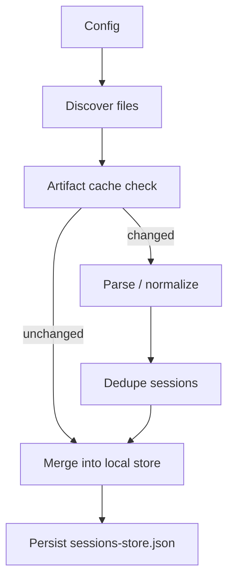

# Sync and Storage

## What this layer does

This layer turns upstream session artifacts into the app’s local searchable history.

Primary files:

- `src/main/sync.ts`
- `src/main/parsers.ts`
- `src/main/opencode.ts`
- `src/main/storage.ts`

## Inputs

| Source | Input | Notes |
| --- | --- | --- |
| Copilot CLI artifacts | repo roots + `~/.copilot/session-state/**` JSON/JSONL | transcript-oriented |
| Copilot CLI summaries | `~/.copilot/session-store.db` | improves titles and cache invalidation |
| VS Code Copilot Chat | workspace storage chat session JSONL | repo path inferred from workspace metadata when possible |
| OpenCode | `~/.local/share/opencode/opencode.db` | loaded from SQLite tables |

## Sync flow

## Discovery

Config fields that affect sync:

- `repoRoots`
- `discoveryMode`
- `explicitPatterns`
- `syncMode`
- `backgroundSyncIntervalMinutes`

Supported discovery modes:

- `autodiscovery`
- `explicit`
- `both`

Built-in autodiscovery patterns:

- `**/.copilot/**/*.{json,jsonl}`
- `**/.vscode/**/*copilot*.{json,jsonl}`
- `**/.github/copilot/**/*.{json,jsonl}`

Scan behavior:

- skips missing or invalid repo roots
- ignores `node_modules`, `.git`, `dist`, `build`, `release`
- enforces a max file size before parsing
- also reads global Copilot and VS Code locations when relevant

## Artifact cache

To keep sync incremental, the app caches parsed artifact results.

Cache entries include:

- file path
- size
- mtime
- repo root
- source
- CLI summary token
- parser version
- normalized inserts

This lets repeated syncs reuse prior normalized results for unchanged artifacts.

## Normalized data model

Shared types live in `src/shared/types.ts`.

Core types:

- `SessionSummary`
- `SessionMessage`
- `SessionDetail`

Important normalized fields:

- source: `cli` / `vscode` / `opencode`
- repo path
- title
- model
- timestamps
- message count
- transcript messages
- optional references/edits
- optional CLI execution mode metadata (`plan`, `autopilot`)

## Parsing

### JSON / JSONL artifacts

Primary file:

- `src/main/parsers.ts`

The parser handles:

- role and format inference
- session metadata extraction
- stable message IDs
- source inference for ambiguous files
- CLI plan/autopilot extraction where explicit signals exist

### OpenCode

Primary file:

- `src/main/opencode.ts`

The OpenCode loader:

- reads session/message/part tables
- filters to configured repo roots
- reconstructs message content
- infers role and format
- tracks the latest model when available

## Merge rules

Primary file:

- `src/main/storage.ts`

Important merge semantics:

- synced sessions are retained locally
- sessions missing upstream are marked, not immediately deleted
- manual archiving is local-only
- manual archives can auto-unarchive if upstream activity changes
- old manually archived sessions are pruned after four months
- starred messages can survive as stale local bookmarks if the upstream message disappears

## Local store

The app persists one JSON file in `userData`:

- `sessions-store.json`

It contains:

- `sessions`
- `messages`
- `stars`
- `artifacts`

## In-memory indexes

`SessionStorage` rebuilds and uses:

- session lookup by ID
- messages by session
- message lookup by session
- stars by session
- lowercased per-session search haystacks
- a small detail LRU cache

These indexes keep list/detail queries cheap without reparsing or rejoining everything on every request.

## Search model

Search currently matches over:

- session ID
- title
- repo path
- agent name
- model
- message content

The model is intentionally simple: prebuilt lowercase haystacks with local substring matching.

## Performance tactics already in place

- cache-aware incremental sync
- deduplication before merge
- in-memory list/detail indexes
- detail LRU cache
- sidebar virtualization
- chunked transcript rendering

## Where to change things

| Change | Primary file(s) |
| --- | --- |
| add/change config fields | `src/main/config.ts`, `src/shared/types.ts` |
| change discovery rules | `src/main/sync.ts` |
| change parsing behavior | `src/main/parsers.ts` |
| change OpenCode ingestion | `src/main/opencode.ts` |
| change retention/archive/star semantics | `src/main/storage.ts` |
| change search indexing | `src/main/storage.ts` |

## Key tradeoff

The app currently prefers a simple local JSON store plus in-memory indexes over an embedded app database.

That keeps packaging simple, but means scalability depends on careful caching, indexing, and rendering limits.

